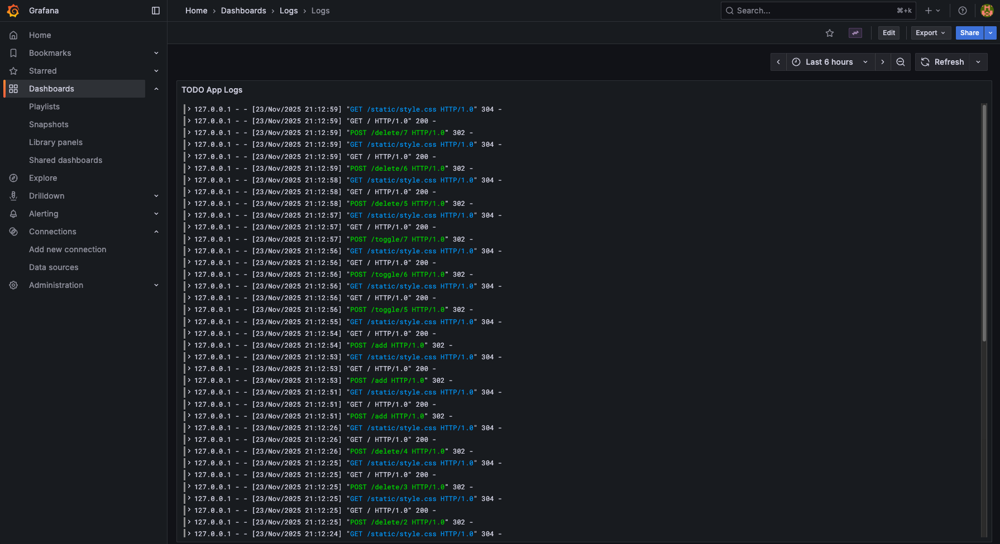

# DevOps Dockerization

This repository contains scripts for deploying a simple to-do app written in Go with dockerized services.

## Services
- App
- Postgres
- Traefik
- Alloy
- Loki
- Grafana

### App
The app is written in Go and uses Gin as the framework.
It supports adding new to-do items, marking them complete and deleting them.

It is accessible on http://app.devops.gapi.me.

https://github.com/user-attachments/assets/0a418ecb-2488-4a0b-913b-510efbaeedc2

### Traefik
Traefik is a reverse proxy that handles routing traffic to all other services.

### Alloy
Alloy reads the app logs from a file every 5 seconds and sends them to Loki.

Its dashboard is accessible on http://alloy.devops.gapi.me.

### Loki
Loki stores logs in its database.

### Grafana
Grafana queries logs from Loki and displays them in a dashboard.

It is accessible on http://grafana.devops.gapi.me.




## Deployment
Starting the container
```bash
docker compose up -d
```

Stopping the container
```bash
docker compose down
```